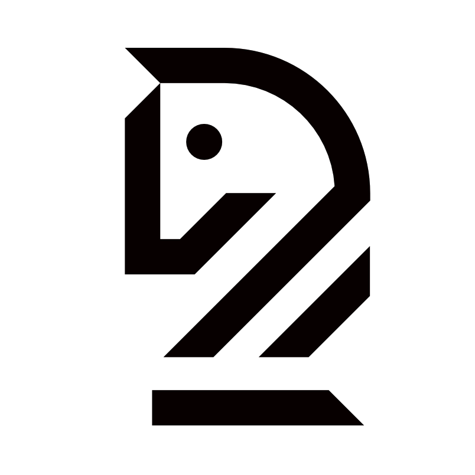

  
  <h1 align="center">
    Chess
  </h1>
  <h3 align="center">
    International chess designed by levels and by modes
  </h3>

  

  
  
  

  

### Introduction
Chess is played on an 8x8 checkerboard, arranged so that there is a white square at the bottom
right. Players take turns making one move at a time. The player controlling the white pieces makes the first move.

### Six types of pieces
- King (K) Moves one square in any direction.
- Queen (Q) Moves in any of the eight possible directions, any distance, but cannot move past any piece that blocks its path.
- Bishop (B) Moves in any of the four diagonal directions, any distance, but cannot move past any piece that blocks its path.
- Rook (R) Moves in any of the four vertical/horizontal directions, any distance, but cannot move past any piece that blocks its path.
- Knight (N) If it sits on square (x,y), it can move to square (x±2,y±1) or (x±1,y±2). Can “jump over” any piece that blocks its path.
- Pawn (P) Moves one square forward.

### Rules for movement of pieces
- A piece captures another piece by moving onto the square occupied by that piece. The captured piece is then permanently removed from the board. A piece that could capture another piece is said to attack that piece. A piece may only capture a piece of the opposite colour.
- The object of the game is to place your opponent’s king under attack, such that your opponent’s king cannot escape in one move. This is known as checkmate. An attack on the king, whether it can escape or not, is known as check.
- The pawn is the only piece whose standard move is different from its capturing move. A pawn moves only forward, but it captures on the forward diagonals (one square). Thus, on capturing, a pawn must move diagonally forward, one square, to take over a square occupied by another piece.
- A pawn, on its first move, may move either one square forward or two squares forward.
- If a pawn, by moving two squares forward, avoids capture by another pawn (i.e, if moving one square forward would have put it under attack by another pawn), the would-be attacking pawn may still capture it by moving one square diagonally forward to the square the other pawn skipped over. This is known as pawn capture en passant. This option is only available immediately following the two-square move by the opposing pawn. If you wait, you can’t do it.
- A pawn, upon reaching the other end of the board is replaced by either a rook, knight, bishop, or queen (your choice).
- A move known as castling helps to move the king to a safer square while simultaneously mobilizing a rook. To execute it, the king moves two squares towards one of the rooks, and that rook then occupies the square “skipped over” by the king. This happens in one move. For castling to be legal, the king and rook used must not previously have moved in the game; there must be no pieces between the king and rook used; and the king must not be in check on either its starting position, its final position, or the position in between (to be occupied by the rook).
- It is not legal to make any move that puts your king in check.
- If any player ever has no legal moves available, but is not in check, it is known as stalemate, and the game is a draw.

### Players
Your system should accommodate both human and computer players. In particular, human vs. human, human vs. computer, and computer vs. computer should all be possible. When both players are human, the role of your program is to provide the game board, to detect checkmate and stalemate, and to prohibit illegal moves. Computer players should operate at one of several difficulty levels:
- Level 1: random legal moves.
- Level 2: prefers capturing moves and checks over other moves.
- Level 3: prefers avoiding capture, capturing moves, and checks.
- Levels 4+: something more sophisticated.
For levels 4 and above, try to come up with more sophisticated strategies for your player to use. Attempt level 4 (or any higher levels) only when the rest of the project is done.

### Contributions
We welcome all contributions.You can submit any ideas as pull requests or as GitHub issues.

### License
[AGPL-3.0](https://github.com/Mint-io/CHESS/blob/master/LICENSE). Copyright (c) 2019 YIMING DAI